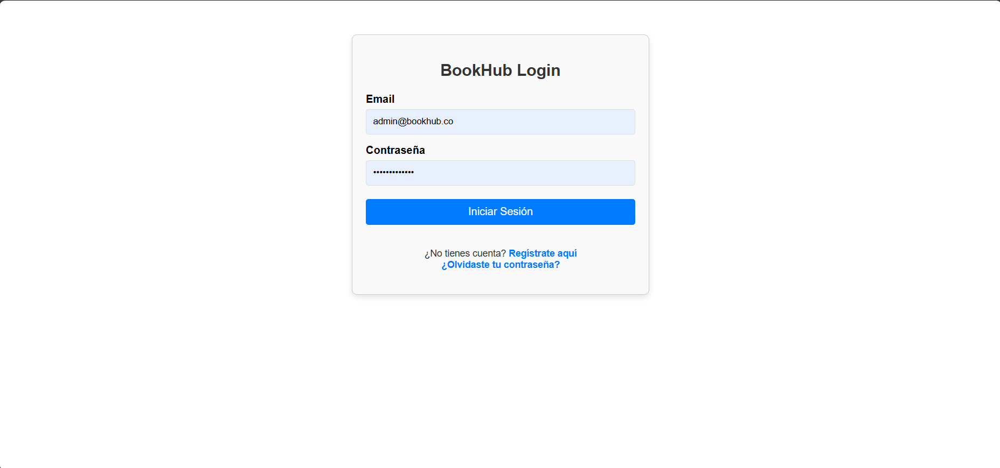
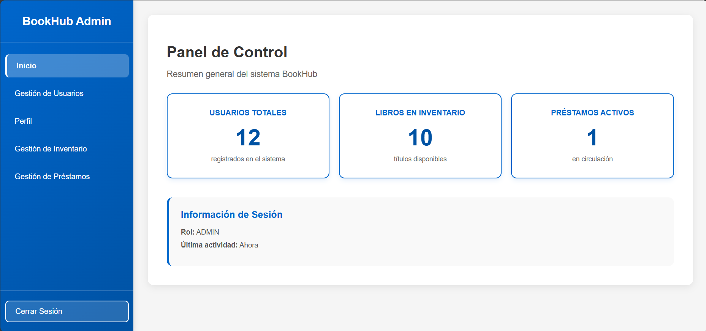
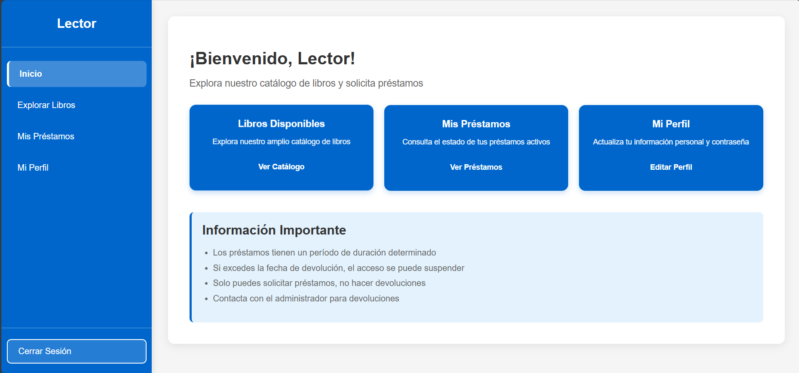

# BookHub - Sistema de Gestión de Bibliotecas

> **Desarrollo de Software III - Proyecto Final**
> **Autor:** Jaider Bermudez (Jaider-Dev)
> **Programa:** Ingeniería de Sistemas
> **Tecnologías:** Java 21, Spring Boot 3.4, Angular 17, Docker, MySQL.
> **Docente:** Mg(c). Juan Pablo Pinillos Reina
> **Institución:** Universidad del Valle
> **Tema:** Sistema de Gestión de Bibliotecas "BookHub"


---

## 📖 Introducción
**BookHub** es una plataforma moderna basada en una **Arquitectura de Microservicios** diseñada para gestionar el ciclo de vida completo de una biblioteca. Permite a los usuarios consultar catálogos, registrar préstamos y devoluciones, y gestiona la seguridad mediante tokens JWT.

El sistema está completamente contenerizado, garantizando un despliegue reproducible y escalable.

---

## 🚀 Inicio Rápido (Quick Start)

Sigue estos pasos para desplegar toda la infraestructura en tu máquina local.

### Prerrequisitos
- Tener instalado **Docker Desktop** (y que esté ejecutándose).
- Git.

### Paso 1: Clonar el repositorio
```bash
git clone https://github.com/Jaider-Dev/bookhub.git
cd bookhub
```

### Paso 2: Ejecutar el sistema
Usa Docker Compose para construir y levantar los 6 contenedores necesarios.

```bash
docker compose up -d --build
```
*(El proceso de build inicial puede tardar unos minutos mientras descarga las dependencias de Maven y NPM)*.

### Paso 3: Acceder a la Aplicación
Una vez finalizado, abre tu navegador favorito y visita:

**[http://localhost:4200](http://localhost:4200)**

**Credenciales de Prueba (Admin):**
- **Email:** `admin@bookhub.co`
- **Password:** `adminpassword`

---

## Documentación Técnica Detallada

La documentación completa del proyecto se encuentra en la carpeta `/docs`.

| Documento | Descripción |
| :--- | :--- |
| **[Arquitectura](./docs/arquitectura.md)** | Diagramas C4, explicación de microservicios y Gateway. |
| **[Base de Datos](./docs/base-datos.md)** | Diagrama ERD, esquemas y diccionario de datos. |
| **[API REST](./docs/api-rest.md)** | Contratos de interfaz, endpoints y diagramas de secuencia. |
| **[Despliegue & Docker](./docs/docker-y-despliegue.md)** | Guía técnica sobre Dockerfiles y Orchestración. |
| **[Resumen del Proyecto](./docs/resumen-proyecto.md)** | Objetivos, Justificación y Conclusiones académicas. |

---

## 🛠️ Stack Tecnológico

**Backend (Microservicios):**
- **Framework:** Spring Boot 3.4
- **Seguridad:** Spring Security + JWT
- **Comunicación:** Spring Cloud Gateway, WebClient
- **Base de Datos:** MySQL 8

**Frontend:**
- **Framework:** Angular 17 (Standalone Components)
- **Estilos:** CSS3 Moderno (Diseño Responsivo)

**DevOps:**
- **Docker:** Contenedores aislados.
- **Docker Compose:** Orquestación y redes.

---
**Login**


**Dashboard admin**


**Dashboard lector**
