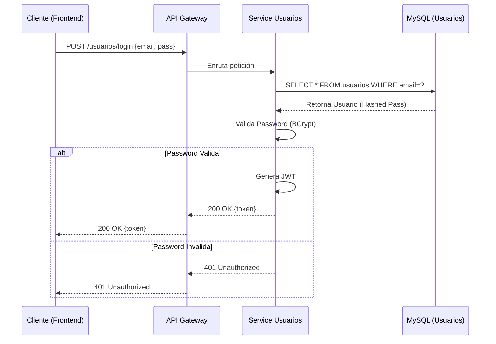
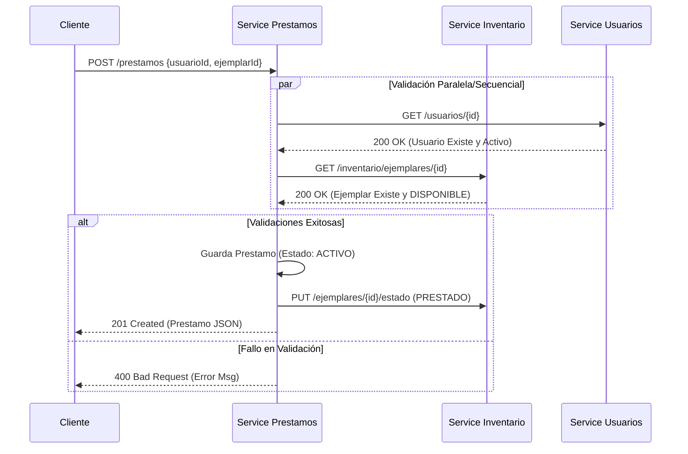
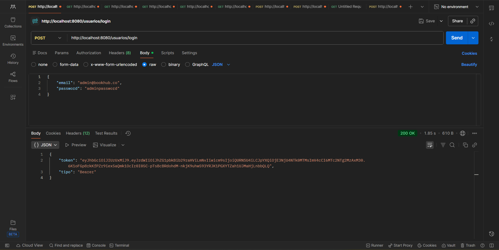
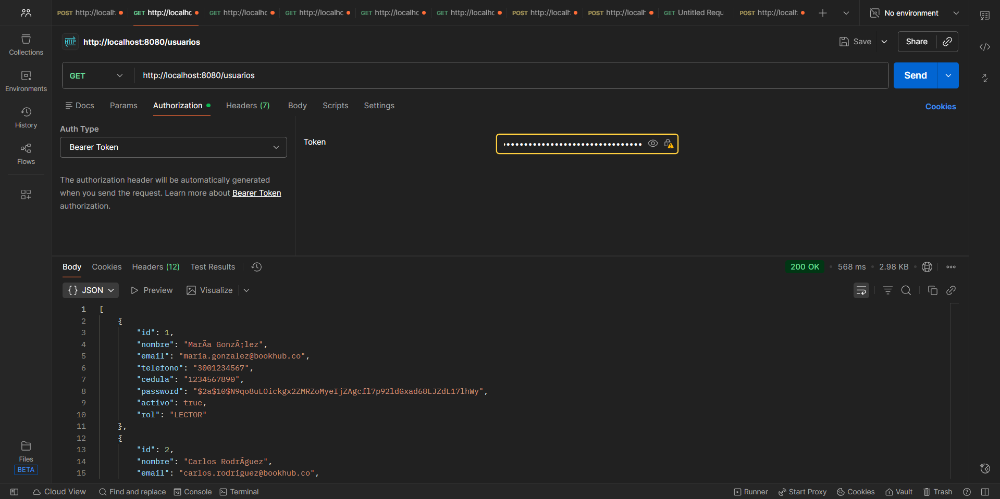

# Documentación API REST

El sistema expone una API RESTful centralizada a través del puerto **8080** (Gateway).

## 1. Flujos de Comunicación (Diagramas de Secuencia)

### 1.1 Flujo de Autenticación (Login)
El usuario envía sus credenciales, y el sistema valida contra la base de datos segura, retornando un Token JWT.

### 1.2 Flujo de Creación de Préstamo
Este flujo es crítico ya que involucra la orquestación de 3 microservicios.

## 2. Catálogo de Endpoints

### 2.1 Módulo Usuarios
**Base URL:** `http://localhost:8080/usuarios`

| Método | Endpoint | Descripción | Body Requerido |
| :--- | :--- | :--- | :--- |
| `POST` | `/login` | Inicia sesión | `{"email": "...", "password": "..."}` |
| `POST` | `/` | Registra usuario (Admin) | `{"nombre": "...", "email": "...", ...}` |
| `GET` | `/` | Lista usuarios | N/A |

### 2.2 Módulo Inventario
**Base URL:** `http://localhost:8080/inventario`

| Método | Endpoint | Descripción | Body Requerido |
| :--- | :--- | :--- | :--- |
| `GET` | `/libros` | Lista el catálogo | N/A |
| `POST` | `/libros` | Crea nuevo libro | `{"titulo": "...", "autor": "...", ...}` |
| `PUT` | `/ejemplares/{id}` | Actualiza estado | `{"estado": "PRESTADO"}` |

### 2.3 Módulo Préstamos
**Base URL:** `http://localhost:8080/prestamos`

| Método | Endpoint | Descripción | Body Requerido |
| :--- | :--- | :--- | :--- |
| `POST` | `/` | Registra préstamo | `{"usuarioId": 1, "ejemplarId": 5}` |
| `PUT` | `/{id}/devolver` | Finaliza préstamo | N/A |
| `GET` | `/` | Historial préstamos | N/A |

---

## Imagenes del consumo de APIs

**POST** - http://localhost:8080/usuarios/login

**GET** - http://localhost:8080/usuarios
