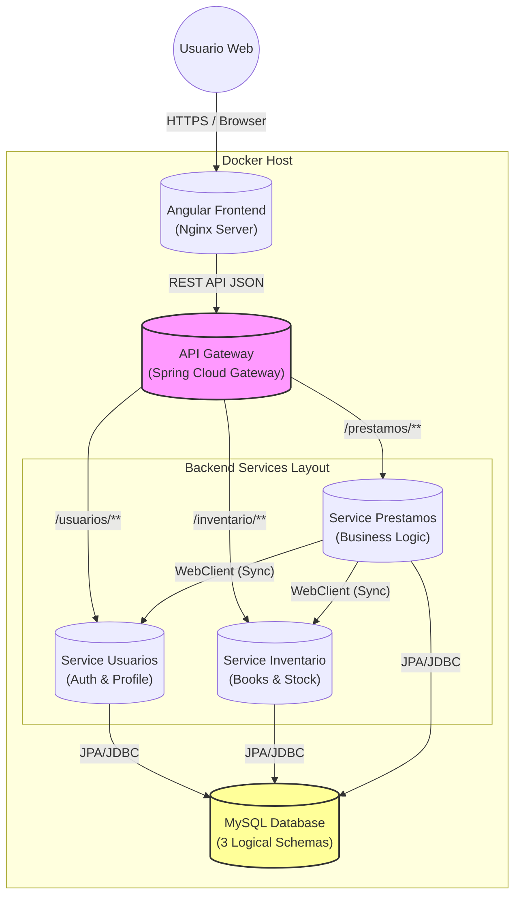

# Arquitectura del Sistema BookHub

## 1. Visión General de la Arquitectura
El sistema **BookHub** sigue un patrón de **Arquitectura de Microservicios**, diseñado para garantizar la escalabilidad, el desacoplamiento y la mantenibilidad. Cada componente del sistema es autónomo y se comunica a través de protocolos ligeros (HTTP/REST) gestionados por un **API Gateway** central.

### Diagrama de Componentes (C4 Nivel 2)
El siguiente diagrama ilustra la interacción entre el Frontend, el API Gateway, los Microservicios y las bases de datos.

## 2. Componentes del Sistema

### 2.1 API Gateway (`bookhub-gateway`)
**Rol:** Punto de entrada único (Reverse Proxy).
- **Tecnología:** Spring Cloud Gateway.
- **Responsabilidad:**
    - Enrutamiento dinámico de peticiones hacia los microservicios.
    - Manejo de **CORS** (Cross-Origin Resource Sharing) global.
    - Abstracción de la topología de la red interna (Docker Network).

### 2.2 Microservicio de Usuarios (`service-usuarios`)
**Rol:** Gestión de identidad y acceso (IAM).
- **Puerto Interno:** 8081.
- **Funciones:**
    - Registro de usuarios.
    - Autenticación segura y emisión de **Tokens JWT** (JSON Web Tokens).
    - Validación de roles (LECTOR, ADMIN).
    - **Patrón:** Controller-Service-Repository.

### 2.3 Microservicio de Inventario (`service-inventario`)
**Rol:** Catálogo bibliográfico.
- **Puerto Interno:** 8082.
- **Funciones:**
    - Gestión de Libros, Autores y Categorías.
    - Control de unidades físicas (**Ejemplares**) y su estado (`DISPONIBLE`, `PRESTADO`).

### 2.4 Microservicio de Préstamos (`service-prestamos`)
**Rol:** Núcleo transaccional.
- **Puerto Interno:** 8083.
- **Funciones:**
    - Orquestación del proceso de préstamo.
    - Comunicación síncrona con *Inventario* (para verificar disponibilidad) y *Usuarios* (para validar identidad).
    - Registro de fechas de vencimiento y devoluciones.

## 3. Patrones de Diseño Implementados

1.  **API Gateway Pattern**: Oculta la complejidad de los microservicios al cliente.
2.  **Database per Service (Lógico)**: Aunque comparten el contenedor MySQL, cada servicio posee su propio esquema (`bookhub_usuarios`, `bookhub_inventario`, etc.), garantizando que un servicio no acceda directamente a las tablas de otro.
3.  **DTO (Data Transfer Object)**: Se utilizan objetos específicos para la transferencia de datos entre capas y servicios, evitando exponer las Entidades JPA directamente.
4.  **Sync Communication**: Uso de `WebClient` (reactivo pero usado síncronamente) para la validación entre servicios.

