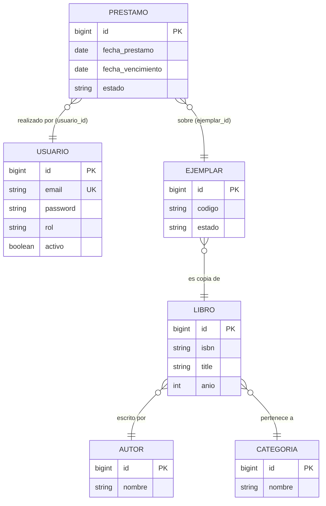

# Diseño de Base de Datos y Persistencia

El sistema **BookHub** utiliza un motor de base de datos **MySQL 8.0** ejecutado en un contenedor Docker. Para mantener la independencia de los microservicios, se han definido tres esquemas lógicos separados.

## 1. Diagrama Entidad-Relación (ERD)

El siguiente diagrama muestra las entidades principales y sus relaciones a través de los diferentes módulos.

## 2. Diccionario de Datos

### 2.1 Esquema `bookhub_usuarios`
Exclusivo para el microservicio de Usuarios.
- **Table `usuarios`**:
    - `id`: Identificador único autoincremental.
    - `email`: Correo único, usado para login.
    - `rol`: `ADMIN` o `LECTOR`.
    - `activo`: `TRUE` (1) o `FALSE` (0). Usado para soft-delete.

### 2.2 Esquema `bookhub_inventario`
Exclusivo para el microservicio de Inventario.
- **Table `libro`**: Información bibliográfica inmutable.
- **Table `autor`**: Catálogo de autores.
- **Table `categoria`**: Clasificación de libros.
- **Table `ejemplar`**:
    - Representa el ítem físico.
    - `codigo_inventario`: Código de barras/interno único.
    - `estado`: `DISPONIBLE`, `PRESTADO`, `REPARACION`.

### 2.3 Esquema `bookhub_prestamos`
Exclusivo para el microservicio de Préstamos.
- **Table `prestamo`**:
    - Registra la transacción.
    - `estado`: `ACTIVO`, `DEVUELTO`, `VENCIDO`.
    - `fecha_devolucion_real`: Captura cuándo se retornó el libro para multas (futuro).

## 3. Integración JPA

La persistencia se gestiona con **Spring Data JPA**.
- Se utiliza la estrategia de generación de IDs `GenerationType.IDENTITY`.
- Las relaciones físicas (`@ManyToOne`) existen solo dentro del mismo microservicio.
- Las relaciones entre microservicios (e.g., Préstamo -> Usuario) se manejan almacenando solo el `Long id` y validando la existencia mediante llamadas API síncronas.
