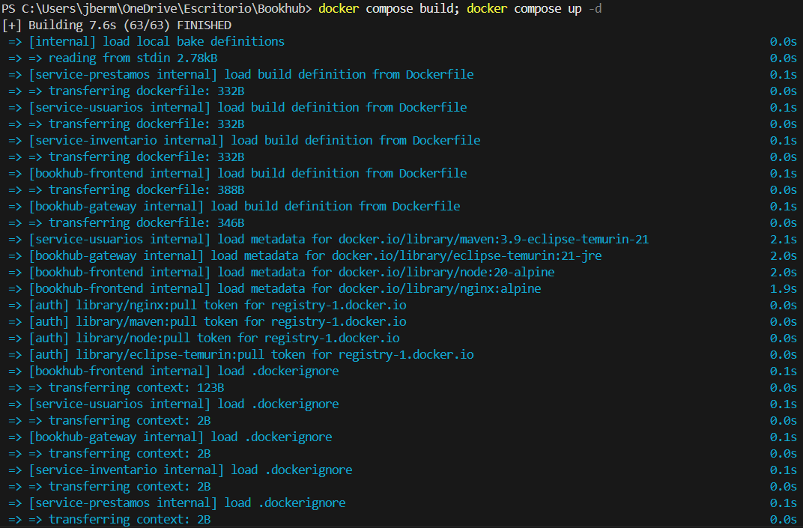
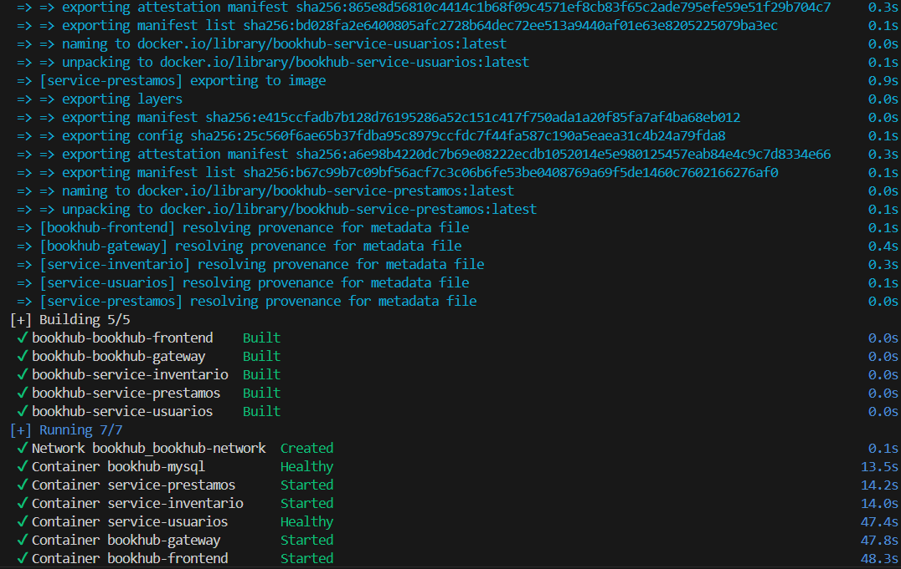

# Guía de Despliegue y Contenerización

El proyecto está diseñado bajo la filosofía **"Infrastructure as Code"** utilizando Docker. Esto asegura que el entorno de desarrollo sea idéntico al de producción y elimina los problemas de "en mi máquina funciona".

## 1. Estrategia de Construcción (Dockerfiles)

### 1.1 Backend (Java Spring Boot)
Se utiliza **Multi-Stage Build** para reducir el tamaño final de la imagen y asegurar que el código fuente no quede en el contenedor final.

```dockerfile
# Etapa 1: Compilación (Build)
FROM maven:3.9-eclipse-temurin-21 AS build
COPY . .
RUN mvn -q -DskipTests package

# Etapa 2: Ejecución (Runtime)
FROM eclipse-temurin:21-jre
COPY --from=build /app/target/*.jar app.jar
ENTRYPOINT ["java","-jar","/app/app.jar"]
```
*   **Ventaja**: La imagen final solo contiene el JRE y el JAR compilado (~200MB), descartando Maven y el código fuente (~800MB).

### 1.2 Frontend (Angular)
Similar al backend, se compila en una imagen Node y se sirve en una imagen Nginx.

```dockerfile
# Etapa 1: Compilación
FROM node:20-alpine AS build
RUN npm run build

# Etapa 2: Servidor Web
FROM nginx:alpine
COPY --from=build /dist/bookhub-frontend /usr/share/nginx/html
```
*   **Ventaja**: Nginx es mucho más eficiente para servir archivos estáticos que un servidor Node.js de desarrollo.

## 2. Orquestación (Docker Compose)

El archivo `docker-compose.yml` define la topología del sistema.

### 2.1 Redes (`networks`)
Se define una red personalizada `bookhub-network` tipo **bridge**.
*   Todos los contenedores se comunican entre sí usando sus nombres de servicio como DNS (e.g., `service-usuarios` resuelve a la IP interna del contenedor).
*   El contenedor `mysql` no expone puerto al host (por seguridad por defecto), solo es accesible por los microservicios dentro de la red.

### 2.2 Volúmenes (`volumes`)
Se utiliza un volumen nombrado `mysql_data` para persistencia.
*   **Propósito**: Si se elimina el contenedor de la base de datos, la información (libros, usuarios) NO se pierde.

### 2.3 Healthchecks (Control de flujo)
Para solucionar problemas de concurrencia (Condiciones de carrera), se implementaron verificaciones de salud.
*   **Caso**: El Gateway intentaba conectar a `service-usuarios` antes de que este iniciara.
*   **Solución**:
    ```yaml
    service-usuarios:
      healthcheck:
        test: "wget --spider -q http://localhost:8081/usuarios || exit 1"
    
    bookhub-gateway:
      depends_on:
        service-usuarios:
          condition: service_healthy
    ```

## 3. Comandos de Ejecución

Para iniciar todo el sistema desde cero:

```bash
# Construir imágenes y levantar servicios en segundo plano
docker compose up -d --build
```

Para ver los logs en tiempo real:

```bash
# Ver logs de todos los contenedores
docker compose logs -f
```

Para detener y limpiar todo:

```bash
# Detiene contenedores y elimina redes (mantiene volúmenes)
docker compose down
```

---


